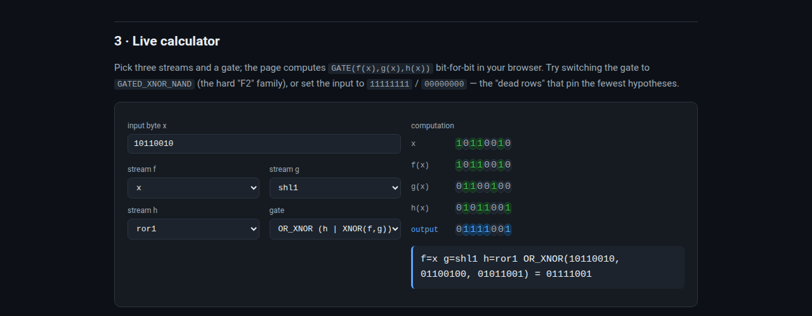
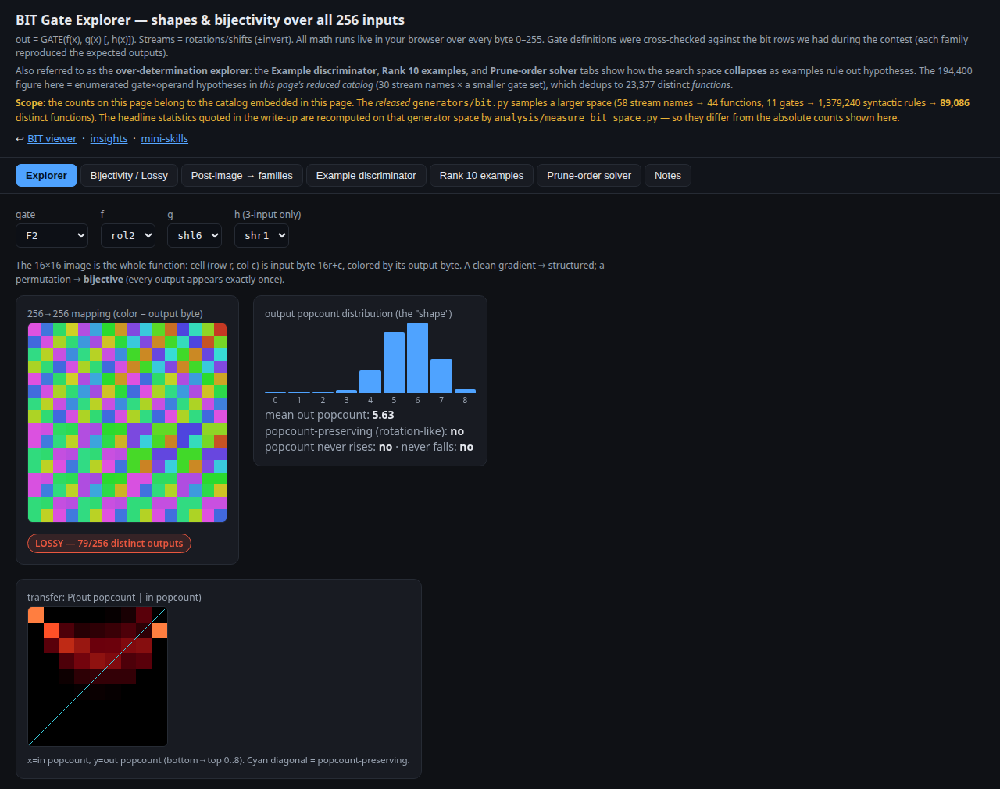
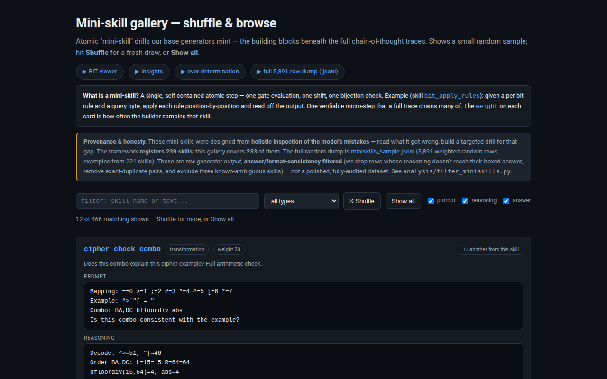

# Understanding the BIT puzzle as GATE(f, g, h) — generators + an honest search write-up

> **Don't learn our solution — learn BIT, or generate it.**

A small, dependency-free companion to our NVIDIA Nemotron Reasoning Challenge
work. The repo is **interactive HTML viewers + puzzle generators**; the write-up
is `insights.html`.

> 🌐 **Live interactive site:** https://definitelynotrussellkirk-bit.github.io/nemotron-puzzle-gen/

## What's here — take what's useful, ignore the rest

Each item below stands on its own; you don't need to read the whole thing to use any one of them.

- **Understand the BIT puzzle** — [`index.html`](https://definitelynotrussellkirk-bit.github.io/nemotron-puzzle-gen/): it's one whole-byte gate over three streams, `GATE(f(x),g(x),h(x))`. The examples uniquely determine the exact rule ~58% of the time; the *simplest* consistent rule (Occam on arity) matches the query answer ~99%.
- **A BIT solver / "Autotracer"** — [`analysis/occam_solver.py`](analysis/occam_solver.py): paste examples + a query, get the simplest consistent rule and the answer. `--stats` reproduces the ~58/83/93/99% figures on random examples (no competition data needed). On the real competition BIT rows our internal solver scored ~99.3%, but train.csv isn't shipped here, so that exact figure isn't reproducible from this repo.
- **Over-determination explorer** — [`over-determination.html`](https://definitelynotrussellkirk-bit.github.io/nemotron-puzzle-gen/over-determination.html): watch the candidate set shrink as examples are added, computed over all 256 inputs.
- **Six puzzle generators** — [`generators/`](generators/): one standard-library sampler per type (bit, encryption, transformation, gravitational, unit, number-conversion). No dependencies.
- **BIT rule-space stats** — [`analysis/measure_bit_space.py`](analysis/measure_bit_space.py): 1,379,240 syntactic rules → 89,086 distinct functions, with assertions.
- **Mini-skill sample** — [`miniskills.html`](https://definitelynotrussellkirk-bit.github.io/nemotron-puzzle-gen/miniskills.html) / `miniskills_sample.jsonl`: 5,891 atomic drill rows.
- **The write-up** — [`insights.html`](https://definitelynotrussellkirk-bit.github.io/nemotron-puzzle-gen/insights.html): what we tried (teach a 30B model to *search* these puzzles), what we saw, what didn't work. BIT runs varied ~12–60%.

[](https://definitelynotrussellkirk-bit.github.io/nemotron-puzzle-gen/)
[](https://definitelynotrussellkirk-bit.github.io/nemotron-puzzle-gen/over-determination.html)
[](https://definitelynotrussellkirk-bit.github.io/nemotron-puzzle-gen/miniskills.html)

Honest scope: we did not get a reliable end-to-end BIT solver out of the model; this is
work-in-progress. Reference: Tong Huikang's public 0.85. Built with Codex and Claude.

---

**What this is (Best Data / Synthetic Data Method).** We set out to teach an LLM to
**search** these reasoning puzzles — enumerate candidate rules, test, prune. We
didn't fully get there. This repo is **what we learned about search** and the
**generators we built** to explore it, shared as honest work-in-progress. The piece
we're happiest with: a clean way to **show** and **generate** the hardest type, BIT,
as `GATE(f(x),g(x),h(x))`, with an interactive viewer to help others *visualize* the
problem and watch the search space collapse. We don't claim a breakthrough — not a
leaderboard result, not a claim we taught the model to solve gates. We hoped to
transfer the search ability into the 30B; results varied a lot (better runs reached
~50–60%, but the worst got only ~12% — a deterministic search where
every step was *locally* solvable yet the model couldn't chain them, like knowing each
letter's successor but being unable to recite the alphabet). Whether that was a failure
on our part or something more fundamental we don't know, so we've included lots of
training traces (the 5,891-row mini-skill dump + the CoT formats) for others to build on. The one piece of our own work that actually
shipped: ~2,500 verified **cipher (cryptarithm) transform rows**, blended onto a
strong public CoT base for our best result. The numeric transformation lane is
largely unexplored; the budget was ~$150.

→ **Live site:** `https://definitelynotrussellkirk-bit.github.io/nemotron-puzzle-gen/`

### Interactive HTML viewers (run on GitHub Pages, no build, no data files)

- **`index.html`** — our **BIT viewer**: explains the BIT puzzle as
  `output = GATE(f(x), g(x), h(x))` with a **live calculator** (pick three
  byte-streams and a gate, watch the output computed bit-by-bit), a generation
  walk-through, and the real bit-data distribution.
- **`over-determination.html`** — shows *how over-solved* the BIT puzzles are:
  sample K examples from a rule and watch candidate hypotheses get killed off one
  at a time (tabs: Example discriminator, Rank 10 examples, Prune-order solver).
  The discriminator fingerprints survivors over all 256 inputs (exact within the
  page's reduced catalog); the prune tab is a **sampled estimate** over an initial
  survivor subset, not an exact uniqueness proof.
- **`miniskills.html`** — a browsable gallery of **random generations of mini-skills**:
  a framework that **registers 239 atomic drills**, designed from *holistic inspection
  of the model's mistakes*. The gallery covers **233** of them (up to 2 random
  generations each); the released **5,891-row** weighted sample
  **`miniskills_sample.jsonl`** contains examples from **221** skills (a random sample,
  so not every registered skill appears). Both are **answer/format-consistency filtered**
  (not "semantic coherence"): rows whose reasoning doesn't reach their boxed answer are
  dropped, exact-duplicate message pairs are removed, and three known-ambiguous skills are
  excluded — `bit_scan_single` (boxes an answer the reasoning never derives) and
  `trans_style_audit` / `trans_style_pick` (competing style interpretations can render the
  same value, so the question isn't always uniquely answerable). Filter is in
  `analysis/filter_miniskills.py`.
- **`insights.html`** — the **write-up**: what we learned about each puzzle
  type's structure. A living page; new insights are appended as sections (a
  copy-paste template is in the source).

### Kaggle Open-Contribution notebook

**`nemotron_data_method.ipynb`** — the submission for the **Best Data / Synthetic
Data Method** award (team finished 147 / 4,354, top 3.4%). Self-contained: it
recreates the generators, runs them live, **links** the three interactive viewers (with
a copy-paste IFrame snippet for forks), and carries the methodology write-up. Rebuild
with `python3 build_notebook.py` after editing any source file.

### Generators

**`generators/`** — one clean, heavily-commented **sampler per puzzle type**.
Each is purely the *forward* (generative) model: pick the hidden rule, sample
inputs, emit `examples + query + answer + the exact rule used`. They show how to
**create** the problems — no solvers, no training traces.

> Note: these six are the **curated, standalone** set — they reproduce the
> *structure* and *method* of each puzzle type, with no traces and no solvers.

### `EXAMPLE GENERATORS/` — the full variety dump (for the write-up)

**`EXAMPLE GENERATORS/`** is the **complete, as-is generator collection** from our
working repo — ~70 files, every puzzle type, every custom CoT format we tried, plus
the whole mini-skill framework. It's here purely to **show the variety** of
data-generation experiments. Unlike the six clean samplers, many files in it emit
reasoning **traces**, import our private solver/training modules, and **may not run
standalone**. The competition is over, so we share all of it as a museum of
attempts. See `EXAMPLE GENERATORS/README.md` for a map.

## The six puzzle types

| Generator | Hidden rule | Notes |
|-----------|-------------|-------|
| `bit.py` | `GATE(f(x), g(x), h(x))` over 8-bit bytes | streams = shifts/rotates/complements; 58 names = **44 stream functions**. Function search (exact rule uniquely determined ~58%) vs answer search (answer forced ~83%; random consistent rule ~93%; simplest consistent rule, **Occam on arity, ~99%**). The class covers **100%** of real BIT puzzles. See `analysis/occam_solver.py` (the "Autotracer") + `measure_bit_space.py`. |
| `encryption.py` | 1:1 letter substitution over a **closed vocabulary** | unknown words resolved by exhaustive same-length candidate testing + bijection rejection |
| `transformation.py` | two numbers → **operation × ordering × style** | `--cipher` disguises digits as symbols; can be genuinely under-determined |
| `gravitational.py` | `d = ½·g·t²`, unknown g | recover rate `d/t²`, verify, apply; graded with tolerance (rounded display) |
| `unit_conversion.py` | `out = in × factor`, unknown factor | recover `out/in`, verify, apply; tolerance grading |
| `number_conversion.py` | integer ↔ Roman numeral | greedy value-table decode / left-to-right scan; 100% exact |

## Usage

Every generator has the same CLI:

```bash
python3 generators/bit.py -n 5 --seed 0                # pretty-print 5 puzzles
python3 generators/bit.py -n 1000 --jsonl > bit.jsonl  # bulk create as JSONL
python3 generators/transformation.py --cipher -n 3      # symbol-disguised digits
python3 generators/number_conversion.py --direction int2roman -n 3
```

Flags (shared): `-n/--num`, `--seed`, `--examples`, `--jsonl`.

Each created puzzle is a dict: `examples`, `query`, `answer`, and the exact
`rule` used to build it.

## The BIT view in one line

The output byte is one boolean **gate** applied across three whole-byte **streams**
of the input — `out = GATE(f(x), g(x), h(x))`. A stream is the input run through one
cheap op (`shl`, `shr`, `rol`, `ror`, complement, identity). Reading the byte *whole*
collapses the space from 2²⁵⁶-per-bit to **89,086** distinct functions — a class that
reproduces **100%** of the real BIT puzzles.

"Solving BIT" splits into two questions. **Search for the function** (exact rule uniquely
determined): ~58%. **Search for the answer** (the query output): the answer is forced
~83%, a random *consistent* rule matches it ~93%, and the **simplest** consistent rule
(**Occam on arity**) matches it ~99%. The generator builds puzzles from simple rules, so
the simplest consistent rule is usually the one it used. `analysis/occam_solver.py` is the
solver ("Autotracer"): paste examples + a query, it returns the simplest consistent rule
and the derivation. `index.html` walks through this from scratch.

## Publishing the page (GitHub Pages)

```bash
# after creating an empty repo on GitHub:
git remote add origin git@github.com:definitelynotrussellkirk-bit/nemotron-puzzle-gen.git
git push -u origin main
# then: repo Settings → Pages → Source: "main" / root → Save
```

The page is a single static file with all math in-browser — no build step.

## Acknowledgments

- **Tong Huikang** — his public Progress-Prize **0.85** solution
  ([github.com/tonghuikang/nemotron](https://github.com/tonghuikang/nemotron)) was the
  reference point we compared our BIT approach against and learned from; the
  per-column / frequency-prior framing shaped how we thought about the problem.
- Programming and task management throughout were done with the help of AI coding
  agents — **OpenAI's Codex** and **Anthropic's Claude** — which wrote and refactored
  much of the generator/analysis code and helped manage the work; Codex in particular
  drove the long-running Tinker experiment loops end-to-end.

## License

MIT — see `LICENSE`.
